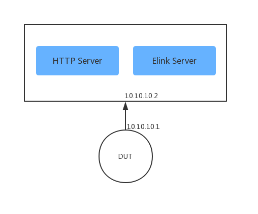

# 安装和使用方法

## 服务端
1. git clone https://github.com/goofool/wolink-server.git
2. go build
3. 启动服务器./elinks

## 客户端
1. 设置DUT默认网关为`服务端`的IP（或者使用iptables做DNAT
`iptables -t nat -A OUTPUT -p tcp -m tcp --dport 32768 -j DNAT --to-destination 服务端IP`）
2. 启动DUT的elink客户端

# 组网图



# API接口

## 获取连接到elinks的客户端列表

### Request
```HTTP
GET http://10.10.10.2:8000/list
```
### Response
```
[
    {
        "uid": "7da71229-bb30-4944-a81b-ebc3f2d7a653",
        "mac": "12:34:56:78:9a:bc",
        "peermac": "EC41182B6F6E",
        "recvseq": 1757200872,
        "seq": 1298498081,
        "devdata": {
            "vendor": "xiaomi",
            "model": "R3G",
            "swversion": "1.2.3",
            "hdversion": "0.0.0",
            "url": "www1.miwifi.com",
            "wireless": "yes"
        },
        "status": {
            "wifi": [
                {
                    "radio": {
                        "mode": "2.4G",
                        "channel": 2
                    },
                    "ap": [
                        {
                            "apidx": 0,
                            "enable": "",
                            "ssid": "Xiaomi_6F6E",
                            "key": "12345678",
                            "auth": "wpapskwpa2psk",
                            "encrypt": "aes"
                        }
                    ]
                },
                {
                    "radio": {
                        "mode": "5G",
                        "channel": 44
                    },
                    "ap": [
                        {
                            "apidx": 0,
                            "enable": "",
                            "ssid": "Xiaomi_6F6E_5G",
                            "key": "12345678",
                            "auth": "wpapskwpa2psk",
                            "encrypt": "aes"
                        }
                    ]
                }
            ],
            "wifiswitch": {
                "status": "ON"
            },
            "ledswitch": {
                "status": "ON"
            },
            "wifitimer": []
        },
        "realdevinfo": null
    }
]
```

## 更新客户端状态
通过/list接口中的uid指定客户端。更新状态成功后，使用/list获取新的状态。
### Request
```
GET http://10.10.10.2:8000/get_status/50ca41f2-0f37-4163-896a-e9279617857e
```

### Response
```
{
    "code": 0,
    "msg": ""
}
```

## 下发开关状态
wifiswitch指定wifi开关(on/off)，ledswitch指定led开关(on/off）。
### Request
```
POST http://10.10.10.2:8000/switch_config/50ca41f2-0f37-4163-896a-e9279617857e
{
      "wifiswitch": {
        "status": "off"
      },
      "ledswitch": {
        "status": "off"
      },
      "WiFitimer": []
}
```
### Response
```
{
    "code": 0,
    "msg": ""
}
```

## 下发wifi配置
如果DUT在路由模式下，下发wifi配置成功后，DUT会变成中继模式。如果DUT已在中继模式下，只会修改配置。
### Request
```
POST http://10.10.10.2:8000/wifi_config/50ca41f2-0f37-4163-896a-e9279617857e
{
      "wifi": [
        {
          "radio": {
            "mode": "5G",
            "channel": 149
          },
          "ap": [
            {
              "apidx": 0,
              "enable": "yes",
              "ssid": "ssid_5G",
              "key": "12345678",
              "auth": "wpa2psk",
              "encrypt": "tkip"
            }
          ]
        },
                {
          "radio": {
            "mode": "2.4G",
            "channel": 1
          },
          "ap": [
            {
              "apidx": 0,
              "enable": "yes",
              "ssid": "ssid",
              "key": "12345678",
              "auth": "wpa2psk",
              "encrypt": "tkip"
            }
          ]
        }
      ]
    }
```
### Response
```
{
    "code": 0,
    "msg": ""
}
```